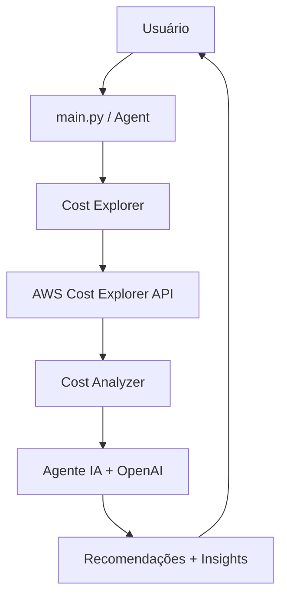

# 🌩️ Jera Cloud Analyzer

> **Agente de IA avançado para análise inteligente de custos AWS com recomendações de otimização automatizadas**

> Esse projeto foi desenvolvido junto do cursor

[](https://python.org)
[](https://aws.amazon.com)
[](https://openai.com)
[](https://haystack.deepset.ai)

## 🚀 **Visão Geral**

AWS Cloud Insights é uma plataforma inteligente de análise de custos que combina **análise avançada de dados AWS** com **inteligência artificial** para fornecer insights acionáveis e recomendações personalizadas de otimização de custos.

### **🎯 Capacidades Principais**

- **🤖 Agente de IA Conversacional**: Análise interativa via linguagem natural
- **📊 Análise Multi-dimensional**: Custos por serviços, tags, regiões e recursos
- **🔍 Detecção Inteligente de Anomalias**: Identificação automática de padrões anômalos
- **📈 Projeções e Tendências**: Análise preditiva de gastos futuros
- **💡 Recomendações Contextualizadas**: Sugestões específicas baseadas nos seus dados
- **🏷️ Mapeamento Completo de Tags**: Correlação entre tags e serviços associados
- **💰 Conversão Automática BRL/USD**: Valores em moeda local com cotação em tempo real

## 🛠️ **Arquitetura do Sistema**

```
┌─────────────────────┐    ┌──────────────────────┐    ┌─────────────────────┐
│   🎯 Entry Layer    │    │   🤖 AI Agent Layer  │    │  ☁️ Cloud Providers │
│                     │    │                      │    │                     │
│ • main.py           │◄──►│ • agent.py           │◄──►│ • aws/              │
│ • Orchestration     │    │ • 15+ Tools          │    │   - cost_explorer   │
│ • Public APIs       │    │ • OpenAI Integration │    │   - cost_analyzer   │
└─────────────────────┘    │ • Haystack Pipeline  │    │   - client          │
                           └──────────────────────┘    │   - utils           │
┌─────────────────────┐    ┌──────────────────────┐    └─────────────────────┘
│  📋 Examples Layer  │    │  🔧 Support Layer    │    
│                     │    │                      │    
│ • analise_tags.py   │    │ • conftest.py        │    
│ • teste_conexao.py  │    │ • requirements.txt   │    
└─────────────────────┘    │ • .env-example       │    
                           └──────────────────────┘    
```

## 📦 **Instalação e Configuração**

### **Pré-requisitos**

- **Python 3.12+**
- **Credenciais AWS** com permissões para Cost Explorer
- **Chave API OpenAI** (para funcionalidades de IA)

### **1. Clonagem e Dependências**

```bash
# Clonar o repositório
git clone https://github.com/seu-usuario/cloud-insights.git
cd cloud-insights

# Criar ambiente virtual (recomendado)
python -m venv .venv
source .venv/bin/activate  # Linux/Mac
# ou
.venv\Scripts\activate     # Windows

# Instalar dependências
pip install -r requirements.txt
```

### **2. Configuração de Credenciais**

#### **Opção A: Arquivo .env (Recomendado)**

```bash
# Copiar o template
cp .env-example .env

# Editar com suas credenciais
nano .env
```

```env
# Credenciais da AWS
AWS_ACCESS_KEY_ID=sua_access_key_aqui
AWS_SECRET_ACCESS_KEY=sua_secret_key_aqui
AWS_REGION=us-east-1

# Chave OpenAI (para funcionalidades de IA)
OPENAI_API_KEY=sua_chave_openai_aqui

# Configurações opcionais
# AWS_PROFILE=nome_do_perfil_aws
# AWS_SESSION_TOKEN=token_de_sessao_temporario
```

#### **Opção B: AWS CLI**

```bash
aws configure
```

#### **Opção C: Variáveis de Ambiente**

```bash
export AWS_ACCESS_KEY_ID=sua_access_key
export AWS_SECRET_ACCESS_KEY=sua_secret_key
export AWS_REGION=sua_regiao
export OPENAI_API_KEY=sua_chave_openai
```

### **3. Permissões AWS Necessárias**

Sua conta/usuário AWS precisa das seguintes permissões:

```json
{
    "Version": "2012-10-17",
    "Statement": [
        {
            "Effect": "Allow",
            "Action": [
                "ce:GetDimensionValues",
                "ce:GetCostAndUsage",
                "ce:GetUsageReport",
                "ce:GetAnomalies",
                "ce:GetCostCategories",
                "ce:ListCostCategoryDefinitions"
            ],
            "Resource": "*"
        }
    ]
}
```

## 🎯 **Guia de Uso**

### **1. Análise Básica via Script**

```python
from src.main import get_cost_overview, analyze_all_tags_with_services

# Visão geral dos últimos 30 dias
overview = get_cost_overview()
print(f"Top 5 serviços mais caros:")
for service in overview["top_services"][:5]:
    print(f"  • {service['service']}: ${service['cost']:.2f}")

# Análise completa de tags
tag_analysis = analyze_all_tags_with_services()
```

### **2. Agente de IA Conversacional**

```python
from src.ia.agent import run_agent_query

# Perguntas em linguagem natural
run_agent_query("Quais são os 10 serviços mais caros do último mês?")
run_agent_query("Como posso otimizar os custos do EC2?")
run_agent_query("Mostre anomalias de custo dos últimos 3 meses")
run_agent_query("Analise os custos por tag 'Environment'")
```

### **3. Análises Específicas**

```python
from src.main import analyze_tag_costs, get_service_details

# Análise por tag específica
env_costs = analyze_tag_costs("Environment", "2024-01-01", "2024-01-31")

# Detalhes de um serviço
ec2_details = get_service_details("Amazon EC2", "2024-01-01", "2024-01-31")
```

### **4. Executação Direta**

```bash
# Análise geral
python src/main.py

# Análise de tags com exemplos
python exemplos/analise_tags.py

# Teste de conectividade
python exemplos/teste_conexao.py
```

## 🔧 **Ferramentas do Agente de IA**

O agente possui **18+ ferramentas especializadas**:

### **📊 Análise de Custos (12 ferramentas)**
| **Ferramenta** | **Descrição** |
|----------------|---------------|
| `get_top_services` | Top serviços mais caros |
| `get_service_details` | Detalhes específicos de um serviço |
| `get_aws_tags` | Lista todas as tags disponíveis |
| `analyze_account_coverage` | Cobertura e distribuição de recursos |
| `discover_account_resources` | Discovery automático de recursos |
| `validate_and_analyze_service` | Validação e análise de serviços |
| `get_dimension_values` | Valores de dimensões específicas |
| `get_instance_cost_by_name` | Custo de instância EC2 por nome |
| `find_instances_by_tag` | Busca instâncias por tags |
| `audit_governance_tags` | Auditoria de governança de tags |
| `aws_ec2_call` | Chamadas dinâmicas para API EC2 |
| `get_account_context_data` | Contexto completo da conta |

### **⚡ Performance & Tráfego (3 ferramentas - NOVO!)**
| **Ferramenta** | **Descrição** |
|----------------|---------------|
| `get_instance_performance_metrics` | **Análise completa de performance EC2** |
| `analyze_ec2_fleet_performance` | **Análise comparativa de múltiplas instâncias** |
| `get_network_traffic_analysis` | **Análise detalhada de tráfego de rede** |

### **🛠️ Utilitárias (4 ferramentas)**
| **Ferramenta** | **Descrição** |
|----------------|---------------|
| `format_currency` | Conversão USD→BRL automática |
| `get_current_date` | Data atual para consultas |
| `get_date_from_period` | Cálculo de datas por período |
| `all_dimensions` | Lista todas as dimensões AWS |

## 🚀 **NOVO: Análise de Performance e Tráfego EC2**

### **🔍 Capacidades Adicionadas:**

- **📈 Métricas CloudWatch em tempo real**: CPU, memória, rede, disco
- **🌐 Análise de tráfego de rede**: Bandwidth, custos de transferência
- **🏭 Fleet Analysis**: Comparação de performance entre instâncias
- **🚨 Alertas inteligentes**: CPU alta/baixa, tráfego excessivo
- **💰 Correlação custo x performance**: Rightsizing baseado em dados
- **🎯 Recomendações acionáveis**: Otimização automática

### **📊 Exemplos de Consultas de Performance:**

```bash
# Análise de instância específica
"Analise a performance da instância Valhalla nas últimas 48 horas"
"Qual o tráfego de rede da instância i-123abc nos últimos 7 dias?"

# Análise de frota
"Compare performance de todas as instâncias do ambiente production"
"Identifique instâncias subutilizadas no projeto web-app"

# Otimização
"Quais instâncias posso reduzir para economizar custos?"
"Analise o tráfego de rede para otimizar custos de transferência"
```

### **🎯 Benefícios da Análise de Performance:**

| **Antes** | **Agora** |
|-----------|-----------|
| ❌ Apenas análise de custos | ✅ **Custos + Performance integrados** |
| ❌ Decisões baseadas só em preço | ✅ **Rightsizing baseado em dados reais** |
| ❌ Reativo a problemas | ✅ **Alertas proativos de sub/superutilização** |
| ❌ Sem visibilidade de tráfego | ✅ **Análise completa de bandwidth e custos** |

## 📁 **Estrutura Detalhada do Projeto**

```
cloud-insights/
├── 📋 Configuração
│   ├── pyproject.toml          # Metadados do projeto
│   ├── requirements.txt        # Dependências Python
│   ├── .env-example           # Template de configuração
│   ├── .gitignore             # Arquivos ignorados
│   └── conftest.py            # Configuração de testes
│
├── 📚 Documentação
│   └── README.md              # Este arquivo
│
├── 🚀 Código Principal
│   └── src/
│       ├── main.py            # 🎯 Entry point e orquestração
│       │
│       ├── 🤖 Inteligência Artificial
│       │   ├── agent.py       # Agente principal (configuração)
│       │   ├── system_prompt.py # Prompt do sistema (separado)
│       │   ├── README.md      # Documentação específica de IA
│       │   └── tools/         # 🛠️ Ferramentas modulares
│       │       ├── __init__.py        # Importações centralizadas
│       │       ├── aws_data_tools.py  # 8 ferramentas AWS
│       │       ├── utility_tools.py   # 4 ferramentas utilitárias
│       │       └── README.md          # Documentação das tools
│       │
│       └── ☁️ Provedores Cloud
│           └── aws/
│               ├── client.py          # Cliente base AWS
│               ├── cost_explorer.py   # Interface Cost Explorer
│               ├── cost_analyzer.py   # Engine de análise
│               ├── utils.py           # Utilitários
│               └── unused/
│                   └── optimizer.py   # Otimizador (legacy)
│
└── 📋 Exemplos e Testes
    ├── exemplos/
    │   ├── analise_tags.py     # Exemplo análise de tags
    │   └── teste_conexao.py    # Teste de conectividade
    └── test_imports.py         # Testes de importação
```

## 🎨 **Exemplos de Consultas de IA**

```bash
# Análises financeiras
"Qual foi o gasto total dos últimos 6 meses?"
"Compare os custos de janeiro vs fevereiro"
"Identifique anomalias nos gastos de EC2"

# Otimização de recursos
"Como posso reduzir custos de armazenamento S3?"
"Quais instâncias EC2 estão subutilizadas?"
"Recomende otimizações para RDS"

# Análise organizacional
"Mostre custos por departamento usando tags"
"Qual projeto tem maior custo-benefício?"
"Distribua custos por ambiente (prod/dev/test)"

# Projeções e planejamento
"Projete gastos para os próximos 3 meses"
"Calcule ROI dos Savings Plans atuais"
"Estime impacto de migrar para instâncias spot"
```

## 🔄 **Fluxo de Dados**



## 🚀 **Roadmap e Funcionalidades Futuras**

- [ ] **Suporte Multi-Cloud** (Azure, GCP)
- [ ] **Dashboard Web Interativo**
- [ ] **Alertas Automáticos** via email/Slack
- [ ] **Integração com Terraform** para análise de IaC
- [ ] **API REST** para integrações externas
- [ ] **Relatórios Automatizados** em PDF
- [ ] **Machine Learning** para detecção avançada de anomalias

## 🤝 **Contribuindo**

Contribuições são muito bem-vindas! Por favor:

1. **Fork** o projeto
2. Crie uma **branch** para sua feature (`git checkout -b feature/AmazingFeature`)
3. **Commit** suas mudanças (`git commit -m 'Add some AmazingFeature'`)
4. **Push** para a branch (`git push origin feature/AmazingFeature`)
5. Abra um **Pull Request**

## 📄 **Licença**

Este projeto está sob a licença MIT. Veja o arquivo `LICENSE` para detalhes.

## 🔗 **Links Úteis**

- [AWS Cost Explorer Documentation](https://docs.aws.amazon.com/cost-explorer/)
- [AWS CloudWatch Documentation](https://docs.aws.amazon.com/cloudwatch/)
- [Haystack AI Framework](https://haystack.deepset.ai/)
- [OpenAI API Documentation](https://platform.openai.com/docs)
- [Boto3 Documentation](https://boto3.amazonaws.com/v1/documentation/api/latest/index.html)

---

**💡 Desenvolvido com IA para análise inteligente de custos e performance AWS**

*O Cloud Insights agora oferece observabilidade completa: custos + performance em uma única plataforma.*